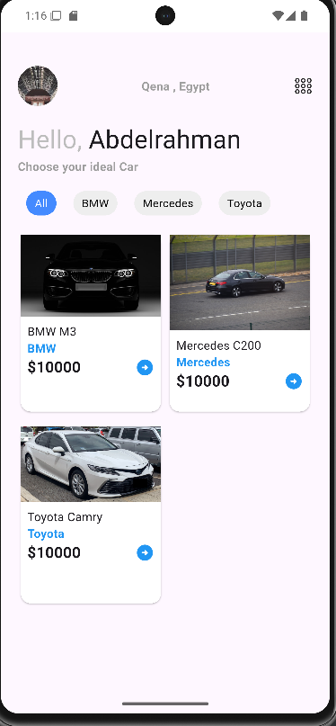
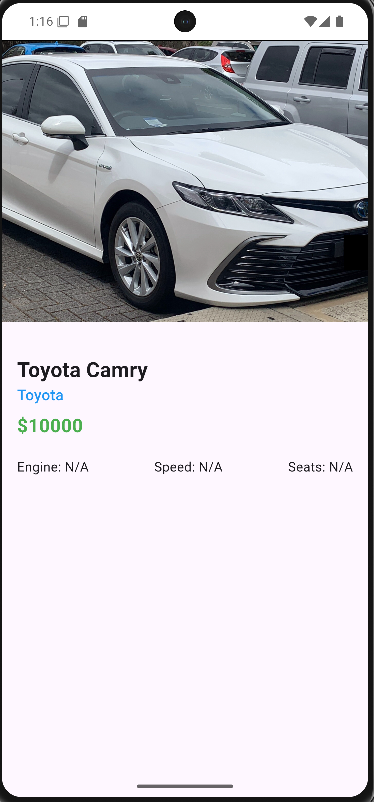
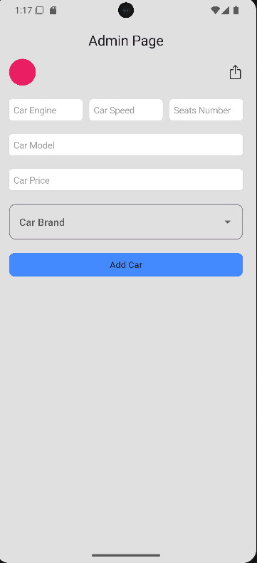
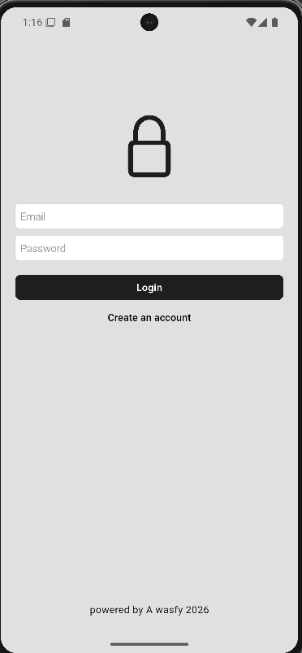

# 🚗 Auto-Swift

Auto-Swift is a Flutter application for browsing and managing cars with a clean and organized project structure.

The project is developed using **Flutter and Firebase**, with a focus on clean UI, authentication, cloud data management, reusable components, and scalable architecture.

---

## 📱 Features

* 🔐 **User Authentication**

  * Login with Email & Password
  * Register with Email & Password
  * Firebase Authentication

* 🏠 **Home Screen**

  * Browse available cars
  * Display car information

* 👨‍💼 **Admin Section**

  * Manage car data
  * Add and manage cars using Firestore

* ☁️ **Cloud Firestore**

  * Store car data
  * Read and manage data from Firestore

* 🧩 **Reusable Custom Components**

* 🧭 **Navigation using GoRouter**

* 📱 **Responsive UI using flutter_screenutil**

* 🔥 **Firebase Integration**

---

## 🛠️ Technologies & Packages

* Flutter
* Dart
* Firebase Core
* Firebase Authentication
* Cloud Firestore
* GoRouter
* Flutter ScreenUtil

---

## 📂 Project Structure

```text
lib/
│
├── core/
│   ├── components/
│   │   ├── custom_botton.dart
│   │   ├── custom_text.dart
│   │   ├── custom_text_field.dart
│   │   └── snack.dart
│   │
│   ├── firebase/
│   │   └── firebase_options.dart
│   │
│   └── routing/
│       ├── app_routes.dart
│       └── router_generation.dart
│
├── features/
│   ├── admin/
│   │   ├── screens/
│   │   │   └── admin_page.dart
│   │   │
│   │   └── ...
│   │
│   ├── auth/
│   │   ├── screens/
│   │   │   ├── login_page.dart
│   │   │   └── register_page.dart
│   │   │
│   │   └── ...
│   │
│   └── home/
│       ├── screens/
│       │   ├── home_page.dart
│       │   └── car_details.dart
│       │
│       └── ...
│
└── main.dart
```
 peoject photo
               

 
---

## 🔥 Firebase

Auto-Swift uses Firebase for:

* Firebase Authentication
* Cloud Firestore
* Firebase Core

Firestore is used to store and retrieve application data, including car information.

---

## 🚀 Getting Started

### 1. Clone the repository

```bash
git clone https://github.com/Abdowasfy/auto-swift
```

### 2. Navigate to the project

```bash
cd auto_swift
```

### 3. Install dependencies

```bash
flutter pub get
```

### 4. Run the application

```bash
flutter run
```

---

## 👨‍💻 Author

**Abdelrahman Mohamed Wasfy**

Flutter Developer | Dart | Firebase
